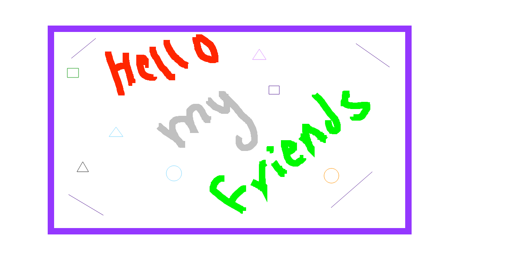

# Paint
## Background and Overview
  Can draw and erase on board with JavaScript, have option to select many tool like color, size of pen, shapes
  and save as image, In addition to undo and rest button to wipe the board  
  
  [Live Demo](https://mmoussa2.github.io/paint/)
  
  

## Technologies:
  - HTML
  - CSS
  - Canvas
  - Javascript
  - JQuery
 

    One of the challenges faced was to make undo, so i implemented stack to save image for each drawing,
    and allowed to save the lasted three images 
    
    document.querySelectorAll("[data-command]").forEach(
  item =>{
    item.addEventListener("click", e =>{
      let command = item.getAttribute("data-command");
      if(command === 'undo'){
        paint.undoPaint();
      }else if(command === 'download'){
        var canvas = document.getElementById("canvas");
        var image = canvas.toDataURL("image/png", 1.0)
        .replace("image/png", "image/octet-stream");
        var link = document.createElement("a");
        link.download = "image.png";
        link.href = image;
        link.click();

      }
    });
  }
);

  undoPaint(){
    if(this.undoStack.length > 0){
      this.context.putImageData(this.undoStack[this.undoStack.length - 1], 0, 0);
      this.undoStack.pop();
    }else{
      return ;
    }
  }
    
